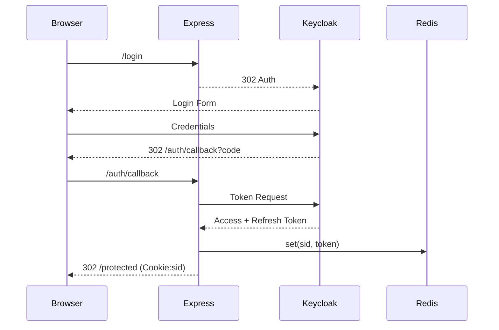

# Keycloak-nodejs-monolith

# Keycloak + Express + Json.db + EJS モノリス設計書（リファクタ版）

> **目的**: 既存ドキュメントを整理・統合し、項目間の重複を排除して読みやすさと実装指針の一貫性を高める。

---

## 1. 全体像

| 項目          | 内容                                                                   |
| ----------- | -------------------------------------------------------------------- |
| **主要技術**    | Node.js 20 LTS / Express 4 / Keycloak 24 / Json.db (lowdb 5) / EJS 3 |
| **認証方式**    | OIDC Authorization Code + PKCE（Keycloak Connect）                     |
| **セッション管理** | `express-session` + Redis (本番) / MemoryStore (PoC)                   |
| **フロントエンド** | サーバサイド EJS（CSR 不要）                                                   |
| **対象機能**    | Sign‑Up / Sign‑In / Me / Logout / Public / Protected                 |

```
┌────────┐ HTTPS ┌────────┐
│ Browser │──────▶│ Keycloak│
└────────┘       └────────┘
      ▲  OIDC Code Flow
      │
      ▼
┌─────────────────────────────┐
│        Express Monolith     │
│ ┌───────┐ ┌───────────────┐ │
│ │  EJS  │ │ keycloak‑connect│ │
│ └───────┘ └───────────────┘ │
│       ▲           ▲         │
│       │           │         │
│ ┌───────────┐ ┌───────────┐ │
│ │ Json.db   │ │ RedisStore│ │
│ └───────────┘ └───────────┘ │
└─────────────────────────────┘
```

---

## 2. Keycloak 設定サマリ

* **Realm**: `demo`（Self‑Registration ON）
* **Client**: `express‑monolith`（Public Client）

  * Redirect URI: `https://localhost:3000/auth/callback`
  * Web Origin: `https://localhost:3000`
* **Roles**: `user`, `admin`（将来拡張）
* **Scopes**: `openid`, `profile`, `email`

---

## 3. データストア設計

| ストア          | 用途       | 実装                     | 備考              |
| ------------ | -------- | ---------------------- | --------------- |
| **Keycloak** | 認証基盤     | Postgres (Keycloak 内部) | ユーザー／ロール管理      |
| **Json.db**  | プロフィール拡張 | lowdb FileSync         | `sub` 主キー       |
| **Session**  | 認証状態保持   | RedisStore             | `sid`‑`sub` 紐付け |

`db.json` エンティティ例:

```json
{
  "profiles": [
    { "sub": "<UUID>", "nickname": "toshikun", "createdAt": "2025‑06‑29T12:34:56Z" }
  ]
}
```

---

## 4. ルーティング & ガード

| メソッド | パス               | ガード       | 処理                    | 備考                   |
| ---- | ---------------- | --------- | --------------------- | -------------------- |
| GET  | `/login`         | Public    | Keycloak へ 302        | コードフロー開始             |
| GET  | `/auth/callback` | Public    | セッション確立               | Token → Redis        |
| GET  | `/logout`        | Session   | Keycloak + Session 破棄 | Cookie 清掃            |
| GET  | `/register`      | Public    | Self‑Registration     |                      |
| GET  | `/me`            | Protected | ユーザー JSON             | `ensureProfile` JOIN |
| GET  | `/public`        | Public    | `public.ejs`          |                      |
| GET  | `/protected`     | Protected | `protected.ejs`       |                      |

---

## 5. ミドルウェア構成

### 5.1 グローバル層

```js
app.use(helmet());
app.use(cors({ origin: ORIGIN, credentials: true }));
app.use(express.json());
app.use(express.urlencoded({ extended: true }));
app.use(morgan('combined'));
```

### 5.2 Keycloak層

```js
const store = new RedisStore(...);
const keycloak = new Keycloak({ store });
app.use(session({ secret: SECRET, store, resave: false, saveUninitialized: false }));
app.use(keycloak.middleware({ logout: '/logout' }));
```

### 5.3 アプリ層

| 名称              | 概要                          |
| --------------- | --------------------------- |
| `currentUser`   | セッション token → `req.user` 復元 |
| `ensureProfile` | Json.db にユーザーレコード生成         |
| `errorHandler`  | 例外を JSON/EJS へ整形            |

---

## 6. セッションライフサイクル



**Logout**: `/logout` → Keycloak front‑channel → `req.session.destroy()` → `clearCookie('connect.sid')`.

---

## 7. セキュリティ要点

1. **HTTPS** フロント／バック間を含め必須。
2. Cookie: `Secure`, `HttpOnly`, `SameSite=Lax`。
3. Rate‑Limit `/login` (`express-rate-limit`).
4. PKCE + `state` 検証。
5. ログは PII マスキング（`sub`, `sid` のみ残す）。

---

## 8. セットアップ手順

### 8.1 前提条件

- Node.js 20 LTS 以上
- Docker と Docker Compose
- Git

### 8.2 インストール

```bash
# 1. リポジトリをクローン
git clone <repository-url>
cd Keycloak-nodejs-monolith

# 2. 依存関係をインストール
npm install

# 3. 環境変数を設定
cp env.example .env
# .envファイルを編集して必要な設定を行う
```

### 8.3 Keycloak セットアップ

```bash
# 1. Keycloak を起動
docker compose up -d keycloak postgres

# 2. Keycloak が起動するまで待機（約30秒）
# http://localhost:8080 でアクセス可能

# 3. Keycloak 管理コンソールにログイン
# URL: http://localhost:8080
# Username: admin
# Password: admin

# 4. Realm を作成
# - "Create Realm" をクリック
# - Realm name: "demo"
# - "Create" をクリック

# 5. Client を作成
# - "Clients" → "Create client"
# - Client ID: "express-monolith"
# - Client Protocol: "openid-connect"
# - Root URL: "https://localhost:3000"
# - "Save" をクリック

# 6. Client 設定
# - Valid Redirect URIs: "https://localhost:3000/auth/callback"
# - Web Origins: "https://localhost:3000"
# - Access Type: "public"
# - "Save" をクリック

# 7. ロールを作成
# - "Roles" → "Add Role"
# - Role Name: "user"
# - "Save" をクリック
# - 同様に "admin" ロールも作成

# 8. ユーザーを作成
# - "Users" → "Add user"
# - Username: "testuser"
# - Email: "test@example.com"
# - "Save" をクリック
# - "Credentials" タブでパスワードを設定
# - "Role Mappings" タブでロールを割り当て
```

### 8.4 アプリケーション起動

```bash
# 開発モードで起動
npm run dev

# または本番モードで起動
npm start
```

### 8.5 アクセス

- アプリケーション: https://localhost:3000
- パブリックページ: https://localhost:3000/public
- 保護されたページ: https://localhost:3000/protected
- ログイン: https://localhost:3000/login

---

## 9. 使用方法

### 9.1 基本的な認証フロー

1. **パブリックページにアクセス**: https://localhost:3000/public
2. **ログインボタンをクリック**: Keycloak のログイン画面にリダイレクト
3. **認証情報を入力**: 作成したユーザーでログイン
4. **保護されたページにアクセス**: 認証後に自動的にリダイレクト
5. **ログアウト**: ログアウトボタンでセッションを終了

### 9.2 API エンドポイント

#### パブリック API
- `GET /api/health` - システムヘルスチェック

#### 認証が必要な API
- `GET /me` - ユーザープロフィール取得
- `PUT /me` - ユーザープロフィール更新
- `GET /api/user` - ユーザー情報取得

#### 管理者専用 API
- `GET /api/admin/stats` - データベース統計
- `GET /api/admin/users` - 全ユーザープロフィール

### 9.3 プロフィール管理

```bash
# プロフィール取得
curl -H "Cookie: connect.sid=<session-id>" https://localhost:3000/me

# プロフィール更新
curl -X PUT -H "Content-Type: application/json" \
     -H "Cookie: connect.sid=<session-id>" \
     -d '{"nickname":"new-nickname"}' \
     https://localhost:3000/me
```

---

## 10. 開発ガイド

### 10.1 プロジェクト構造

```
Keycloak-nodejs-monolith/
├── app.js                 # メインアプリケーションファイル
├── middleware.js          # カスタムミドルウェア
├── routes.js              # ルーティング定義
├── services/
│   └── database.js        # データベースサービス
├── views/                 # EJS テンプレート
│   ├── layout.ejs
│   ├── public.ejs
│   ├── protected.ejs
│   ├── admin.ejs
│   └── error.ejs
├── data/                  # Json.db データファイル
├── public/                # 静的ファイル
├── docker-compose.yml     # Docker Compose 設定
├── package.json
└── README.md
```

### 10.2 環境変数

| 変数名 | 説明 | デフォルト値 |
|--------|------|-------------|
| `PORT` | アプリケーションポート | `3000` |
| `NODE_ENV` | 実行環境 | `development` |
| `SESSION_SECRET` | セッション秘密鍵 | `fallback-secret` |
| `KEYCLOAK_AUTH_SERVER_URL` | Keycloak サーバーURL | `https://localhost:8080` |
| `KEYCLOAK_REALM` | Keycloak Realm名 | `demo` |
| `KEYCLOAK_CLIENT_ID` | Keycloak クライアントID | `express-monolith` |
| `KEYCLOAK_PUBLIC_CLIENT` | パブリッククライアントフラグ | `true` |
| `REDIS_URL` | Redis接続URL | `redis://localhost:6379` |
| `CORS_ORIGIN` | CORS許可オリジン | `https://localhost:3000` |

### 10.3 ログとデバッグ

```bash
# 開発モードでログを確認
npm run dev

# 本番モードでログを確認
NODE_ENV=production npm start
```

---

## 11. トラブルシューティング

### 11.1 よくある問題

#### Keycloak に接続できない
- Docker Compose が正常に起動しているか確認
- Keycloak の起動完了を待つ（約30秒）
- ファイアウォール設定を確認

#### 認証エラー
- Keycloak のクライアント設定を確認
- Redirect URI と Web Origin の設定を確認
- ユーザーとロールの設定を確認

#### セッションエラー
- Redis が正常に起動しているか確認
- セッション秘密鍵の設定を確認
- Cookie 設定を確認

### 11.2 ログ確認

```bash
# Keycloak ログ
docker compose logs keycloak

# PostgreSQL ログ
docker compose logs postgres

# Redis ログ
docker compose logs redis

# アプリケーションログ
# コンソール出力を確認
```

---

## 12. 本番環境デプロイ

### 12.1 本番環境設定

```bash
# 環境変数を本番用に設定
NODE_ENV=production
SESSION_SECRET=<strong-secret>
REDIS_URL=<production-redis-url>
KEYCLOAK_AUTH_SERVER_URL=<production-keycloak-url>
```

### 12.2 セキュリティ強化

- HTTPS 証明書の設定
- 強力なセッション秘密鍵の使用
- 本番用 Redis の設定
- ファイアウォール設定
- ログローテーション設定

---

## 13. ライセンス

ISC License

---

## 14. 貢献

プルリクエストやイシューの報告を歓迎します。

---

## 15. サポート

問題が発生した場合は、以下の手順でサポートを受けてください：

1. このREADMEのトラブルシューティングセクションを確認
2. ログを確認してエラーの詳細を把握
3. GitHub イシューを作成（可能であれば）
