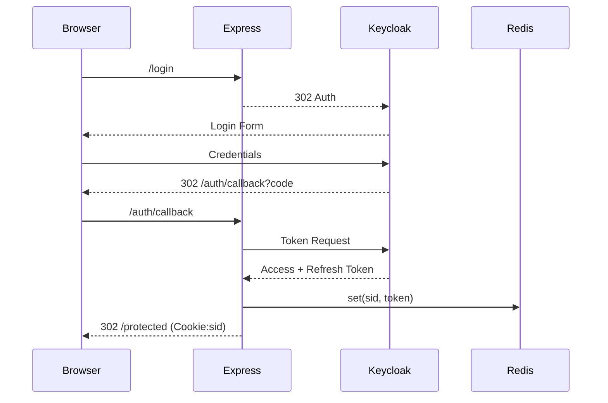

# Keycloak-nodejs-monolith

# Keycloak + Express + Json.db + EJS モノリス設計書（リファクタ版）

> **目的**: 既存ドキュメントを整理・統合し、項目間の重複を排除して読みやすさと実装指針の一貫性を高める。

---

## 1. 全体像

| 項目          | 内容                                                                   |
| ----------- | -------------------------------------------------------------------- |
| **主要技術**    | Node.js 20 LTS / Express 4 / Keycloak 24 / Json.db (lowdb 5) / EJS 3 |
| **認証方式**    | OIDC Authorization Code + PKCE（Keycloak Connect）                     |
| **セッション管理** | `express-session` + Redis (本番) / MemoryStore (PoC)                   |
| **フロントエンド** | サーバサイド EJS（CSR 不要）                                                   |
| **対象機能**    | Sign‑Up / Sign‑In / Me / Logout / Public / Protected                 |

```
┌────────┐ HTTPS ┌────────┐
│ Browser │──────▶│ Keycloak│
└────────┘       └────────┘
      ▲  OIDC Code Flow
      │
      ▼
┌─────────────────────────────┐
│        Express Monolith     │
│ ┌───────┐ ┌───────────────┐ │
│ │  EJS  │ │ keycloak‑connect│ │
│ └───────┘ └───────────────┘ │
│       ▲           ▲         │
│       │           │         │
│ ┌───────────┐ ┌───────────┐ │
│ │ Json.db   │ │ RedisStore│ │
│ └───────────┘ └───────────┘ │
└─────────────────────────────┘
```

---

## 2. Keycloak 設定サマリ

* **Realm**: `demo`（Self‑Registration ON）
* **Client**: `express‑monolith`（Public Client）

  * Redirect URI: `https://localhost:3000/auth/callback`
  * Web Origin: `https://localhost:3000`
* **Roles**: `user`, `admin`（将来拡張）
* **Scopes**: `openid`, `profile`, `email`

---

## 3. データストア設計

| ストア          | 用途       | 実装                     | 備考              |
| ------------ | -------- | ---------------------- | --------------- |
| **Keycloak** | 認証基盤     | Postgres (Keycloak 内部) | ユーザー／ロール管理      |
| **Json.db**  | プロフィール拡張 | lowdb FileSync         | `sub` 主キー       |
| **Session**  | 認証状態保持   | RedisStore             | `sid`‑`sub` 紐付け |

`db.json` エンティティ例:

```json
{
  "profiles": [
    { "sub": "<UUID>", "nickname": "toshikun", "createdAt": "2025‑06‑29T12:34:56Z" }
  ]
}
```

---

## 4. ルーティング & ガード

| メソッド | パス               | ガード       | 処理                    | 備考                   |
| ---- | ---------------- | --------- | --------------------- | -------------------- |
| GET  | `/login`         | Public    | Keycloak へ 302        | コードフロー開始             |
| GET  | `/auth/callback` | Public    | セッション確立               | Token → Redis        |
| GET  | `/logout`        | Session   | Keycloak + Session 破棄 | Cookie 清掃            |
| GET  | `/register`      | Public    | Self‑Registration     |                      |
| GET  | `/me`            | Protected | ユーザー JSON             | `ensureProfile` JOIN |
| GET  | `/public`        | Public    | `public.ejs`          |                      |
| GET  | `/protected`     | Protected | `protected.ejs`       |                      |

---

## 5. ミドルウェア構成

### 5.1 グローバル層

```js
app.use(helmet());
app.use(cors({ origin: ORIGIN, credentials: true }));
app.use(express.json());
app.use(express.urlencoded({ extended: true }));
app.use(morgan('combined'));
```

### 5.2 Keycloak層

```js
const store = new RedisStore(...);
const keycloak = new Keycloak({ store });
app.use(session({ secret: SECRET, store, resave: false, saveUninitialized: false }));
app.use(keycloak.middleware({ logout: '/logout' }));
```

### 5.3 アプリ層

| 名称              | 概要                          |
| --------------- | --------------------------- |
| `currentUser`   | セッション token → `req.user` 復元 |
| `ensureProfile` | Json.db にユーザーレコード生成         |
| `errorHandler`  | 例外を JSON/EJS へ整形            |

---

## 6. セッションライフサイクル



**Logout**: `/logout` → Keycloak front‑channel → `req.session.destroy()` → `clearCookie('connect.sid')`.

---

## 7. セキュリティ要点

1. **HTTPS** フロント／バック間を含め必須。
2. Cookie: `Secure`, `HttpOnly`, `SameSite=Lax`。
3. Rate‑Limit `/login` (`express-rate-limit`).
4. PKCE + `state` 検証。
5. ログは PII マスキング（`sub`, `sid` のみ残す）。

---

---

## 9. デプロイ手順（開発）

```bash
# 1) Keycloak 起動
$ docker compose up -d keycloak
# 2) .env に CLIENT_ID 等を設定
# 3) アプリ起動
$ node app.js
# 4) アプリ確認
$ open https://localhost:3000/public
```

---
